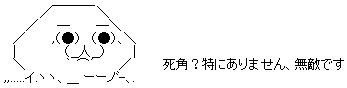

基本データ
------

- 名前: 原 将己 (Masaki Hara)
- 誕生日: 1993/05/31
- 所属: 東京大学 前期課程 教養学部 _

基本データ その2
------

- ハンドルネーム: qnighy
- Twitter: [@qnighy](https://twitter.com/qnighy/)
- Github: [qnighy](https://github.com/qnighy)
- Blog: [簡潔で覚えやすいタイトルを3秒で思いつく程度の能力](http://d.hatena.ne.jp/qnighy/)

基本データ その3
------

- OS: Windows7の上にXubuntu (VirtualBox)
- エディタ: vimとEmacsを使い分け
- 好きなプログラミング言語: Coq
- よく使うプログラミング言語: Ruby, C++
- 好きなソートアルゴリズム: heap sortとbitonic sort
- 好きなジャンル: 百合モノ・女装モノ・TSF
- 最近読んでる漫画: よつばと！・咲 _

主な経歴
------

- [国際情報オリンピック(IOI) 2010年カナダ大会](http://www.ioi2010.org/) 金メダル(300人中16位タイ)
- [国際情報オリンピック(IOI) 2011年タイ大会](http://www.ioi2011.or.th/) 銀メダル(302人中28位タイ)
- [Supercomputing Contest 2009](http://new-web.gsic.titech.ac.jp/supercon/main/attwiki/index.php?Supercomputing%20Contest%202009) 優勝 (チームZATORIKU)
- [Supercomputing Contest 2010](http://new-web.gsic.titech.ac.jp/supercon/main/attwiki/index.php?Supercomputing%20Contest%202010) 優勝 (チームZATORIKU)
- [セキュリティ＆プログラミングキャンプ2008](http://www.jipdec.or.jp/archives/project/camp/2008/camp2008report/index.html) プログラミングコース 卒業
- [第51回 日本学生科学賞](http://event.yomiuri.co.jp/2007/science_51th/top.htm) ICT部門 中学の部 文部科学大臣賞 受賞 ([作品紹介ページ](http://event.yomiuri.co.jp/jssa/works/works_prize51.htm))

主な資格
------

経歴(時系列)
------

- 2006/04 [筑波大学附属駒場中学校](http://www.komaba-s.tsukuba.ac.jp/official/index.htm) 入学
- 2007/02 [第6回 日本情報オリンピック](http://www.ioi-jp.org/joi/2006/index.html) 予選Aランク(満点) ・ 本選参加
- 2007/10 [第51回 日本学生科学賞](http://event.yomiuri.co.jp/2007/science_51th/top.htm) ICT部門 中学の部 文部科学大臣賞 受賞 ([作品紹介ページ](http://event.yomiuri.co.jp/jssa/works/works_prize51.htm))
- 2008/03 [第7回 日本情報オリンピック](http://www.ioi-jp.org/joi/2007/index.html) 予選Aランク(満点) ・ 本選Aランク(優秀賞) ・ 代表選抜合宿参加
- 2008/08 [セキュリティ＆プログラミングキャンプ2008](http://www.jipdec.or.jp/archives/project/camp/2008/camp2008report/index.html) プログラミングコース 卒業
- 2009/03 [第21回 アジア太平洋数学オリンピック(APMO)](http://cms.math.ca/Competitions/APMO/) 銅賞
- 2009/03 [第8回 日本情報オリンピック](http://www.ioi-jp.org/joi/2008/index.html) 予選Aランク ・ 本選Aランク(優秀賞) ・ 代表選抜合宿参加
- 2009/03 [第19回 日本数学オリンピック](http://www.imojp.org/mo2009/jmo2009/seiseki.html) 予選Aランク ・ 本選通過(成績優秀者) ・ 代表選抜合宿参加
- 2009/04 [筑波大学附属駒場高等学校](http://www.komaba-s.tsukuba.ac.jp/official/index.htm) 入学
- 2009/05 [第4回 アジア太平洋情報オリンピック(APIO)](http://apio.olympiad.org/2010/results.html) 銀メダル
- 2009/08 [Supercomputing Contest 2009](http://new-web.gsic.titech.ac.jp/supercon/main/attwiki/index.php?Supercomputing%20Contest%202009) 予選通過 ・ 本選優勝 (チームZATORIKU)
- 2010/03 [第9回 日本情報オリンピック](http://www.ioi-jp.org/joi/2009/index.html) 予選Aランク(満点) ・ 本選Aランク(銀賞) ・ 代表選抜合宿参加 ・ 日本代表
- 2010/03 [第20回 日本数学オリンピック](http://www.imojp.org/mo2010/jmo2010/seiseki.html) 本選銅賞 ・ 代表選抜合宿参加
- 2010/08 [第22回 国際情報オリンピック カナダ大会(IOI2010)](http://www.ioi2010.org/) 金メダル(300人中16位タイ)
- 2010/08 [Supercomputing Contest 2010](http://new-web.gsic.titech.ac.jp/supercon/main/attwiki/index.php?Supercomputing%20Contest%202010) 予選通過 ・ 本選優勝 (チームZATORIKU)
- 2011/03 [第10回 日本情報オリンピック](http://www.ioi-jp.org/joi/2010/index.html) 予選Aランク ・ 本選Aランク(銀賞) ・ 代表選抜合宿参加 ・ 日本代表
- 2011/07 [第23回 国際情報オリンピック タイ大会(IOI2011)](http://www.ioi2011.or.th/) 銀メダル(302人中28位タイ)
- 2012/04 [東京大学](http://www.u-tokyo.ac.jp/index_j.html) 入学(理科一類)

